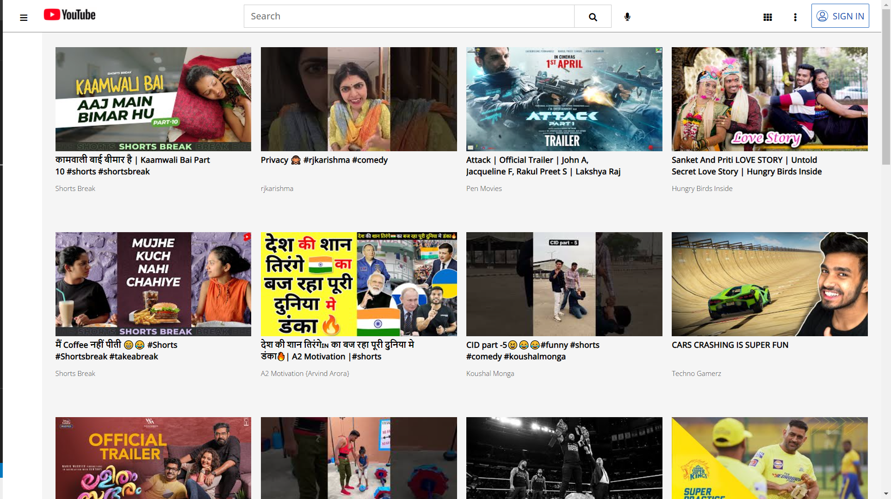
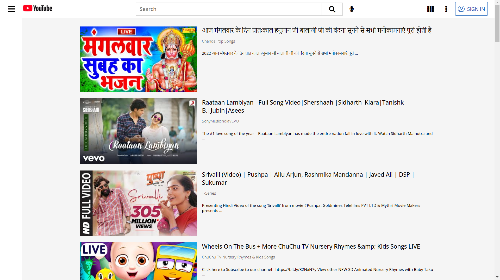
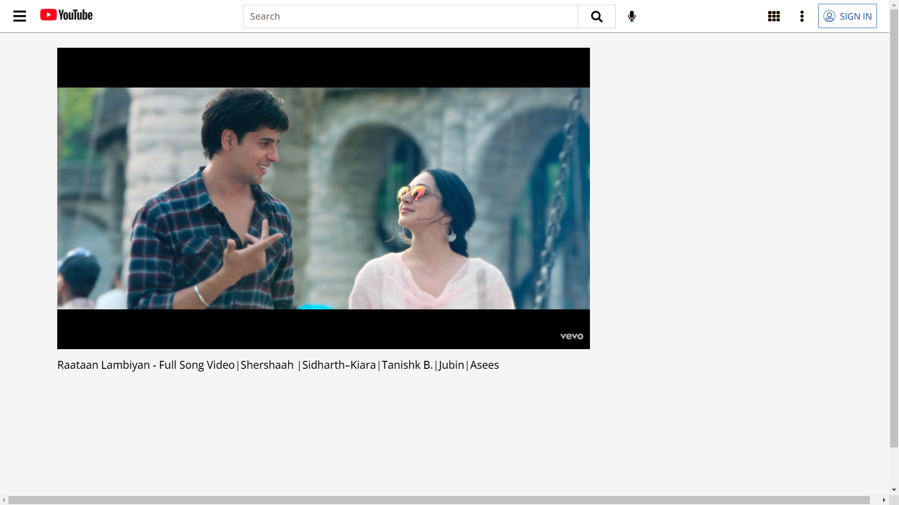

<h1>Youtube clone</h1>

It is my first individual web project at Masai. 

<h3>I have cloned the Youtube Webpage <a href="https://youtube.com/" target="_blank">https://youtube.com/</a> . Its a online video search platform where we can get any kind of videos as per our requirement. </h3>

<h2>Stack and Libraries Used</h2>
<ul>
  <li>HTML</li>
  <li>Javascript</li>
  <li>Css</li>
</ul>

  
<h3>Deployment Link</h3>
<a href="https://youtube-clone-cbcbe7.netlify.app/">https://youtube-clone-cbcbe7.netlify.app/</a>

Home Page

Search Result Page

 Video Player Page

 
<h2>Team Members and Contributors</h2>
 

<h3>Nikhil Shakya</h3>
<ul>
  <li>Github:  <a href= "https://github.com/devmanush-forEach" >devmanush-forEach</a></li>
  <li>Email:shakyanikhil12345@gmail.com </li>
  <li>LinkedIn: <a href="https://www.linkedin.com/in/nikhil-shakya-3a1939213/">https://www.linkedin.com/in/nikhil-shakya-3a1939213/ </a></li>
</ul>

 

